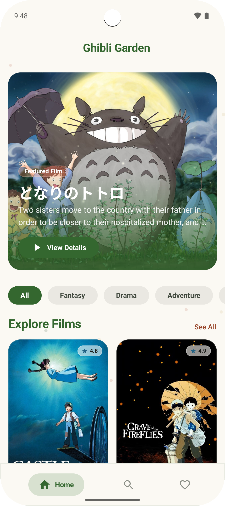
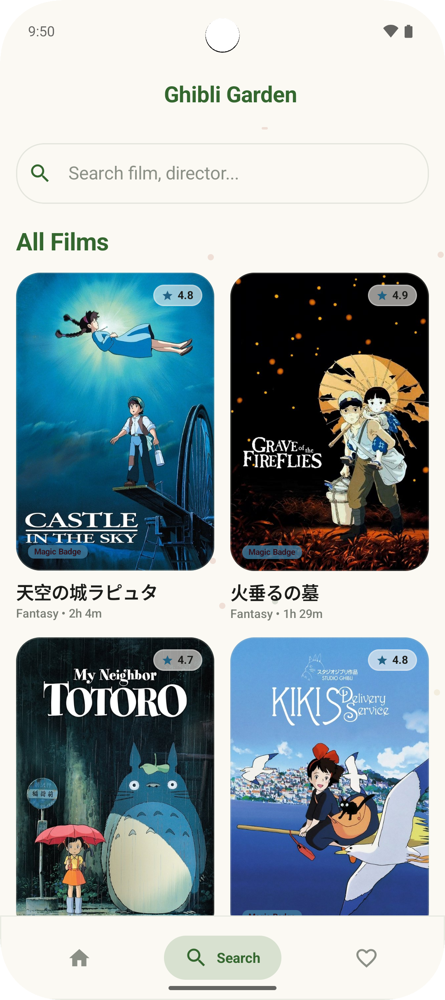
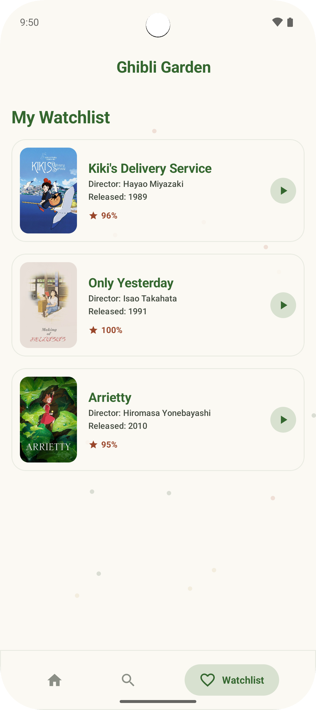
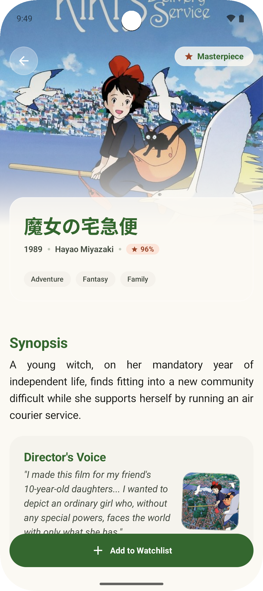
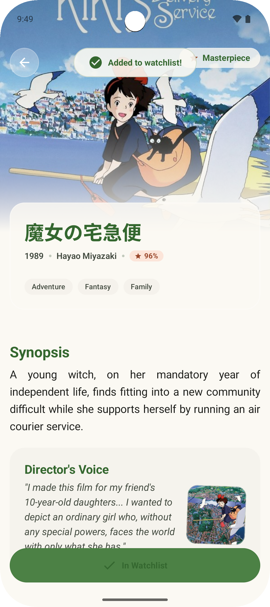
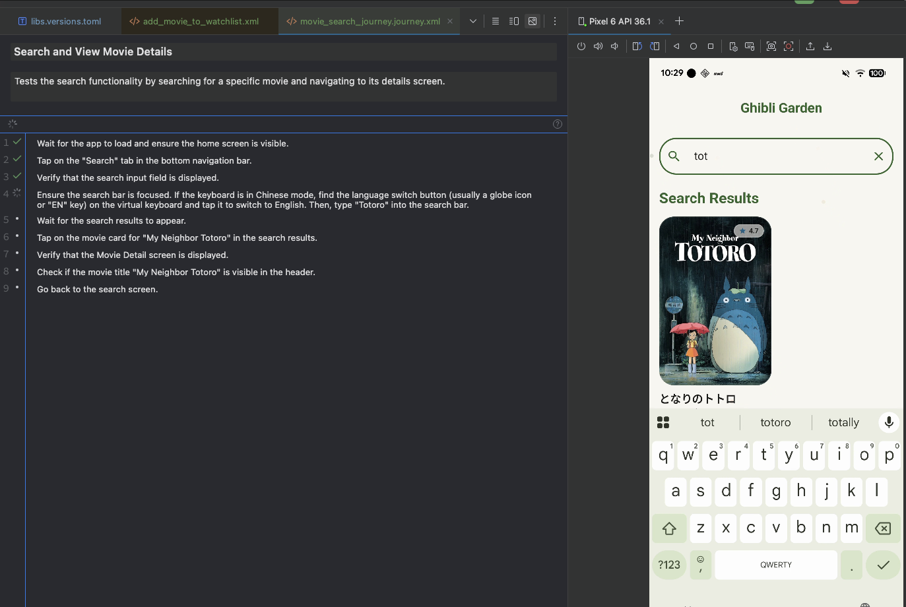

# 🌿 JiburiAiAgent - Studio Ghibli Film Guide

**English** | [繁體中文](README_ZH.md)

[](https://kotlinlang.org)
[](https://developer.android.com/jetpack/compose)
[](https://ktor.io)
[](https://developer.android.com/training/data-storage/room)
[](https://insert-koin.io)

**JiburiAiAgent** is a modern Android application built for Studio Ghibli fans. Inspired by the classic animations of Hayao Miyazaki and Isao Takahata, this app combines modern Android development best practices with premium visual aesthetics and dynamic animations to deliver a fluid, immersive, and elegant guide to Studio Ghibli films.

---

## 🎨 Screenshots

Experience the rich fantasy atmosphere of Studio Ghibli through our carefully crafted user interface:

<p align="center">
  
  
  
</p>
<p align="center">
  
  
</p>

---

## ✨ Core Features

- **🍂 Immersive Ghibli Aesthetics & Animations**
  - **Soot Sprites Background Animation**: Delightful floating soot sprites and dust bunnies rendered via Canvas, breathing life into the screen.
  - **Glassmorphism Bottom Navigation**: A sleek, frosted-glass semi-transparent navigation bar that dynamically adapts to background shifts.
  - **Featured Hero Movie**: A premium header section spotlighting the legendary classic *My Neighbor Totoro*.
  - **Coming Soon Preview Card**: A custom-designed card celebrating *The Boy and the Heron*.

- **🔍 Decoupled Search Screen**
  - An independent `SearchScreen` built strictly around single-responsibility principles.
  - **Director Filter Chips**: Support single or multi-selection chips to filter Ghibli catalog by directors (e.g., Hayao Miyazaki, Isao Takahata).
  - **Debounced Reactive Search**: Employs debouncing on user queries to supply lag-free, instant search results.

- **💾 Single Source of Truth (Room + Ktor SSOT)**
  - Automatically fetches and syncs film details from the Studio Ghibli API via **Ktor** when online.
  - Utilizes a **Room Database** as the offline-first Single Source of Truth (SSOT).
  - The application functions seamlessly without internet connectivity.

- **🎬 Meticulous Movie Profiles**
  - Displays release year, duration, and Rotten Tomatoes scores.
  - **Director Quote Cards**: Showcases inspiring thoughts and quotes from legendary directors.
  - **Watchlist Toggles**: Seamless add-to-watchlist features with dynamic Snackbar feedback.

---

## 🛠 Tech Stack

- **Jetpack Compose (2026.02.01)**: Modern declarative UI toolkit.
- **Ktor HTTP Client (3.0.1)**: High-performance asynchronous client with CIO engine, custom Safe API Call wrapper, and robust JSON deserialization.
- **Room Database (2.7.0)**: Robust offline-first caching and real-time Kotlin Flow sync.
- **Koin (4.0.0)**: Lightweight and developer-friendly DI framework utilizing `viewModelOf` constructor injections.
- **Kotlinx Coroutines & Serialization**: Fast JSON handling and multi-threaded reactive flows.
- **Coil (2.6.0)**: Image loading with fading and memory caching.
- **Type-Safe Compose Navigation**: Safe navigation routing via Kotlin `@Serializable` objects.
- **Journeys JUnit Engine (0.3.0)**: XML-driven automated user journey testing for Android.

---

## 🛡️ Automated Journey Testing

We implement **Automated Journey Testing** using the `Journeys JUnit Engine` to ensure critical user paths remain functional and consistent across updates. These tests simulate real user interactions and verify state transitions throughout the app.

<p align="center">
  
</p>

### 🛣️ Defined Journeys:
- **🔍 Movie Search Journey**: Validates the end-to-end flow from the home screen, through the search tab, to the movie detail page.
- **❤️ Watchlist Journey**: Verifies that adding and removing movies from the watchlist correctly persists data and updates the UI.
- **📂 Category Switch Journey**: Ensures smooth transitions and correct data filtering when switching between movie categories.
- **🔄 State Consistency Journey**: Checks if the app maintains its state (e.g., search results, scroll positions) during navigation or configuration changes.

---

## 📐 Architectural Blueprint

Following **MVI (Model-View-Intent)** patterns paired with a strict **Package-by-Feature** modular design:

```
com.lihan.jiburiaiagent/
│
├── core/                         # Shared core infrastructure
│   ├── data/                     # Database setup, Ktor client
│   ├── di/                       # Core dependency injection (CoreModule)
│   ├── domain/                   # Domain entities, Result wrapper
│   └── presentation/             # Global themes, shared UI components
│
├── explore/                      # Exploration home tab (Hero, categories, watchlist)
│   ├── data/                     # Remote and local repositories
│   ├── di/                       # DI bindings (ExploreModule)
│   ├── domain/                   # Movie models and repository interfaces
│   └── presentation/             # MVI components (State, Action, Event, VM, Screen)
│
├── search/                       # Search tab feature
│   ├── di/                       # DI bindings (SearchModule)
│   └── presentation/             # Independent Search MVI components
│
└── detail/                       # Film detail page feature
    ├── di/                       # DI bindings (DetailModule)
    └── presentation/             # Detail MVI components
```

---

## 🚀 Getting Started

### Prerequisites
- Android Studio Ladybug (2024.2.1) or higher
- JDK 17
- Android SDK 24+ (Android 7.0+)

### Setup
1. Clone the repository:
   ```bash
   git clone https://github.com/chenlihan/JiburiAiAgent.git
   ```
2. Open the project in Android Studio.
3. Wait for Gradle sync to complete, choose an emulator or physical device, and click **Run**.

---

## 📝 Development Journey & Optimizations

- **UseCase Layer Removal**: Streamlined architecture by binding ViewModels directly to repositories, reducing boilerplate while boosting performance.
- **SearchScreen Extraction**: Extracted the home tab's nested search component into an isolated search module featuring a debounced reactive pipeline.
- **Migration to Ktor**: Fully replaced Retrofit2 with a flexible, coroutine-native Ktor networking client and robust safety wrappers.

---

*“In the midst of everyday chaos, let Ghibli's magic bring you warmth.”* ✨
